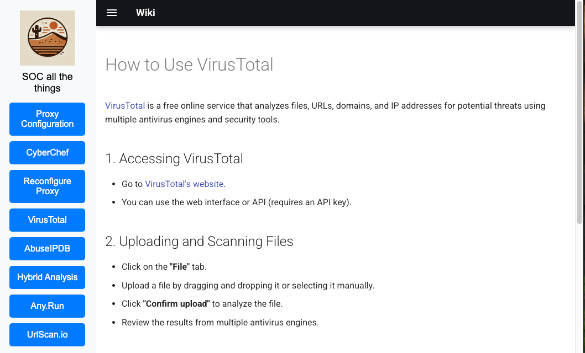

# SOC_Tools_Dashboard



## Prerequisites
Ensure you have the following installed before running the project:
- [Docker](https://docs.docker.com/get-docker/)
- [Docker Compose](https://docs.docker.com/compose/install/)

## Installation

Clone the repository:
```sh
git clone https://github.com/M507/SOC_Tools_Dashboard.git
cd SOC_Tools_Dashboard
```

## Running with Docker Compose

### Start the Services
```sh
docker compose up -d
```

### Stop the Services
```sh
docker compose down
```

### Restart the Services
```sh
docker compose restart
```

## Services Overview

The project consists of the following services:

- The main web application runs on port `5080`
- MkDocs serves documentation on port `5081`
- CyberChef runs on port `5082`


